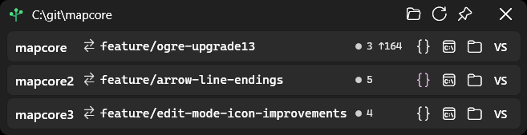

# Worktree Helper

A small Windows tray app that lists the git worktrees of a repository and opens any of them
in VS Code, a terminal, or File Explorer — and tells you at a glance which one you left work
in.



Each row is one worktree: its folder name, the branch it is on, and — only when there is
something to say — a dot with the number of uncommitted paths and `↑`/`↓` counts against its
upstream. A quiet row means there is nothing waiting in it.

- **Lives in the tray.** Left-click toggles the window, right-click lists the worktrees so one
  can be opened in VS Code without the window ever appearing. Closing the window (or `Esc`)
  hides it; **Exit** on the tray menu quits.
- **Knows what is already open.** The VS Code button is tinted for a worktree that already has
  a window, and clicking focuses that window instead of opening a second one.
- **Keeps the paths you gave it.** A folder reached through a symbolic link or junction has two
  names, and git always reports the target; see [Symbolic links](#symbolic-links-and-junctions).
- **Sizes itself** to the list after every load, capped to the monitor's work area, and parks in
  the corner by the notification area until you move it — then it remembers where you put it.
- **One instance.** Launching it again shows the copy already in the tray.
- WPF on .NET 10 with the Fluent theme, following the Windows light/dark setting live, and
  Per-Monitor V2 DPI aware. Built for Windows 11; on Windows 10 the title-bar colour and
  rounded corners simply do not apply.
- Remembers the repository, the window position and the pin in
  `%APPDATA%\WorktreeHelper\settings.json`.

## Install

Grab `WorkTreeHelper-V*.zip` from the releases and unzip `WorktreeHelper.exe` anywhere — there
is no installer, and the app writes only the settings file above.

It needs:

| Requirement | Why |
|---|---|
| **.NET 10 Desktop Runtime**, x64 | The exe is ~350 KB: it carries the app, not the runtime. The *Desktop* runtime, not the plain one — this is WPF. <https://dotnet.microsoft.com/download/dotnet/10.0> |
| **`git` on PATH** | Every listing is `git worktree list` / `git status` under the hood. |
| Windows 10 or 11, x64 | Published `win-x64`. |

VS Code and Windows Terminal are optional — those buttons fall back to `code` on PATH and to
PowerShell. The exe is unsigned, so Windows shows a SmartScreen prompt the first time
(**More info** → **Run anyway**).

## Use

1. Point it at a repository: the **folder** button in the title bar (`Ctrl+O`), or drop a
   folder onto the window, or click the path in the title bar (`Ctrl+L`) and type one. Any
   folder inside the repository or inside any of its worktrees will do — `git worktree list`
   reports all of them from any of them.
2. Per row, from the buttons on the right:
   - **`{}`** — Visual Studio Code. Tinted when that worktree already has a window, and then
     it focuses rather than launches. Double-clicking the row does the same thing.
   - **terminal** — Windows Terminal (`wt -d`), falling back to PowerShell.
   - **folder** — File Explorer.
   - **`VS`** — only for repositories that carry a Visual Studio script; see below.
3. **Right-click a row** for the same actions plus **Copy path** and **Copy branch name**.
   Hovering a row shows its full path; hovering the drift counts spells them out in words and
   names the upstream they are measured against.
4. **Refresh** (`F5`) re-reads everything, and so does showing the window from the tray. The
   pin keeps the window above other windows, and survives a restart.

## Build

Requires the .NET 10 SDK (bundled with Visual Studio 2026, or from
<https://dotnet.microsoft.com/download>) and `git` on PATH.

```bat
build.cmd
```

which is `dotnet publish` into `dist\WorktreeHelper.exe`, framework-dependent and single-file.
For development, `dotnet run` or open `WorktreeHelper.csproj`.

```bat
test.cmd
```

covers the two parsers and the symbolic-link rewriting — the places the bugs actually were.
The link tests build junctions in `%TEMP%`, which needs no elevation; where even that is
refused they assert nothing rather than failing on the environment.

## Symbolic links and junctions

A folder reached through a link has two names — `C:\git\repo` may be a link to `D:\git\repo` —
and git always reports the target. Typing the path is the way to pick the link itself, because
the folder browser resolves links and can only ever hand back the target. When the chosen
folder is reached through one, the worktree paths are rewritten back through it
([`LinkPaths.cs`](LinkPaths.cs)), so the list and everything the buttons launch use the name
you picked. Each rewritten path is checked to be a real second name for that folder; anything
outside the link keeps the path git gave.

## The Visual Studio button

This one is opt-in by convention rather than configuration: a worktree whose root holds
**`CreateVS-2026.bat`** gets a `VS` button that runs it. Repositories without such a script
show nothing there, which is why the rest of the app works anywhere.

The script runs in a visible console — it generates the solution, which takes minutes, prints
progress and can stop for input — with the worktree as its working directory. Once an instance
has that worktree's solution open the button tints and focuses it instead, which is read from
the **Running Object Table** rather than window titles: every worktree of a repository
generates a solution of the same name, so the captions are identical, while the automation
object knows the solution's real path. An instance running elevated while this app is not
cannot be seen, since the two do not share a Running Object Table.

> VS Code exposes no API for "which folders are open", and its process list only ever names the
> folder the *first* window was launched with, so that detection matches window titles instead.
> Because `window.title` is user-configurable, every `" - "`-separated segment is compared
> against the worktree's folder name rather than assuming the default template. Two folders
> sharing a leaf name are therefore indistinguishable.

## Files

| File | Purpose |
|------|---------|
| `App.xaml(.cs)` | Fluent theme following the OS theme; the single-instance gate |
| `SingleInstance.cs` | Mutex plus a broadcast that raises the copy already running |
| `app.manifest` | PerMonitorV2 DPI awareness, long paths |
| `MainWindow.xaml(.cs)` | UI and view logic |
| `TitleBar.cs` | Caption colour and rounded corners, via DWM |
| `GitService.cs` | Runs and parses `git worktree list --porcelain` and `git status --porcelain=v2` |
| `TrayIcon.cs` | The notification-area icon, straight through `Shell_NotifyIcon` |
| `PopupPlacement.cs` | Puts the tray menu on the cursor and gives it the foreground |
| `LinkPaths.cs` | Rewrites git's paths back through the symbolic link you picked |
| `Launcher.cs` | Opens VS Code / terminal / Explorer / the Visual Studio script |
| `VsCodeWindows.cs` | Finds and focuses the VS Code window that has a worktree open |
| `VisualStudioInstances.cs` | The same for Visual Studio, through the Running Object Table |
| `MonitorWorkArea.cs` | Work area of the monitor the window is on, for the auto-size cap |
| `Settings.cs` | JSON settings in `%APPDATA%` |
| `tests\WorktreeHelper.Tests` | xunit cover for the parsers and the link rewriting |

## License

[Apache 2.0](LICENSE).
